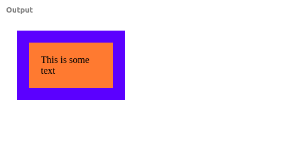
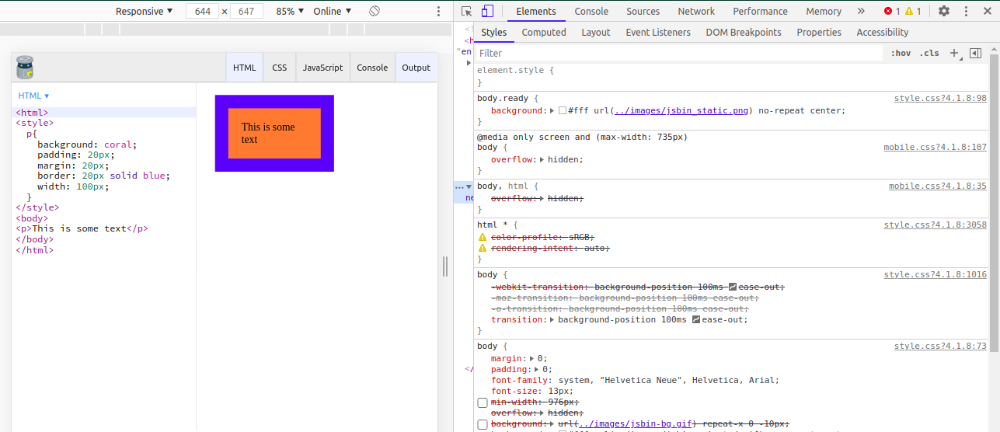
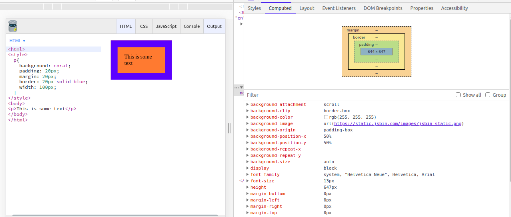

<h2>Well hello there my Gorgeous friends on the internet.</h2>

<h2>let me introduce my self first! My name is pawan and  Thats it!  Just kidding. You can Find me Here -> <a href="https://pavandeore.github.io">Portfolio</a>
 
Okay. So what are we looking at 
</h2>
<h2>⚙ Topic : Introduction to Box Model ⚙</h2>

<h4>Before proceeding with learning any other CSS concepts, you should Master box model first!
</h4>
<h4>
we can say box model is the basic building block of CSS. Before we go any further, everyone needs to understand that every element on Web page is a rectangular box.
</h4>

<h4>
So what are the various term involved in Box Model  
<ul>
<li>Padding</li>
<li>Margin</li>
<li>Content</li>
<li>Border</li>
</ul>
</h4>

<h4>
Follow this steps to see Box Model in live action inside the Browser.
</h4>
<h4>
1] First save the below code in name.html and open in Chrome  
<blockquote>
&lt;html&gt; 
&lt;style&gt; 
p{ 
    background: coral; 
    padding: 20px; 
    margin: 20px; 
    border: 20px solid blue; 
    width: 100px; 
  }
 &lt;/style&gt; 
&lt;body&gt; 
&lt;p&gt;This is some text&lt;/p&gt; 
&lt;/body&gt; 
&lt;/html&gt;
</blockquote>
</h4>
<h4>
You will See Output like this: 

</h4>
<h4>
2] Now Press <kbd>ctrl+shift+i</kbd> OR <kbd>fn+f12</kbd> OR Open Developer Tools
  
You will be able to see this window  
  
Click on Computed option i.e. Second option 
You will see this 
  
Now what you need to do is Press <kbd>ctrl+shift+c</kbd> OR Select the Element and click on the p element  Then Hover on the Box Model you will able to see which part of the element is padding and which part is margin and which is content.  So overall it should look like this  

</h4>
<h4>
3] Now we need the understand how box model Works!  
<ul>
<li>First we have given background: coral that means the p i.e. paragraph element will have background color coral to it.</li>
<li>So the background color will cover Content and Padding box as we can see.</li>
 <li>Note: You can always go ahead change the values for padding and margin to see in action.</li> 
<li>Border will be at above the padding and below the margin it will not affect the position.</li>
<li>If we hover on Content we can see that width will affect only not the Padding and Margin.</li>
<li>Now Margin is the main factor if we change the value then it will affect the position of element.</li>
</ul>
</h4>

<h2>
You can additionally change the values of margin and padding using this guide.
</h2>
<h4>
for the any element if we write,

margin : 10px 20px 30px 40px;
 This means value will be set for 
margin : Top Right Bottom Left <u>Side</u>  
Same thing will also be aplicable for padding also 
padding : 10px 20px 30px 40px;
 This means value will be set for 
padding : Top Right Bottom Left <u>Side</u> 
</h4>

<h2>
⚙ Things to Remember ⚙ 
</h2>
<h4>
<ul>
<li>Default box behaviour of element will be content-box .</li>
<li>You can change this behaviour by using box-sizing property .</li>
<li>Possible value will be
<ul>
<li><kbd>box-sizing: content-box;</kbd> <h5>here if we change height and width it will include only content NOT padding and border</h5></li>
<li><kbd>box-sizing: border-box;</kbd><h5>here if we change height and width it will include content, padding and border as well.</h5></li>
</ul>
</li>
<li>Last but not least The best way to learn is by doing!</li>
</ul>
</h4>

Thanks 😊

