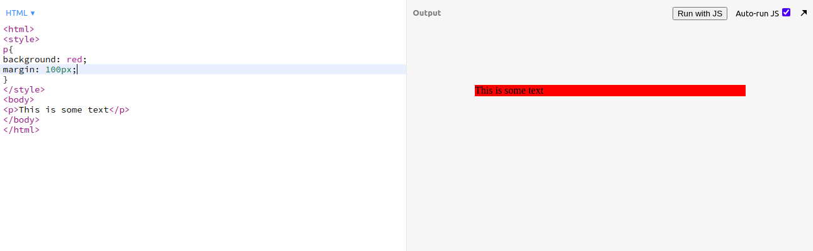
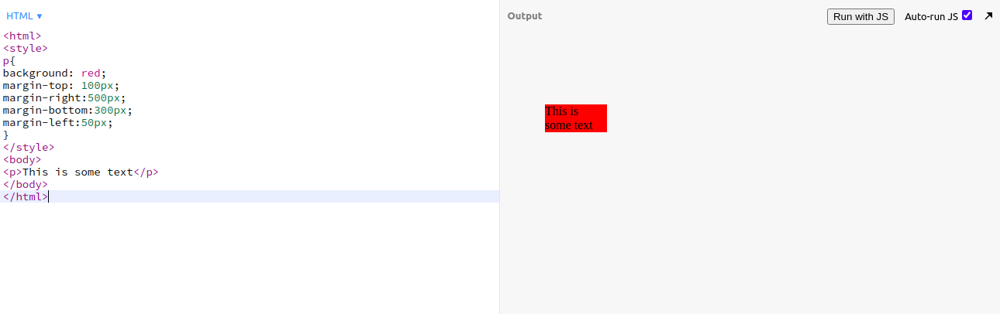
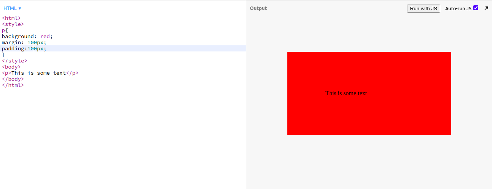
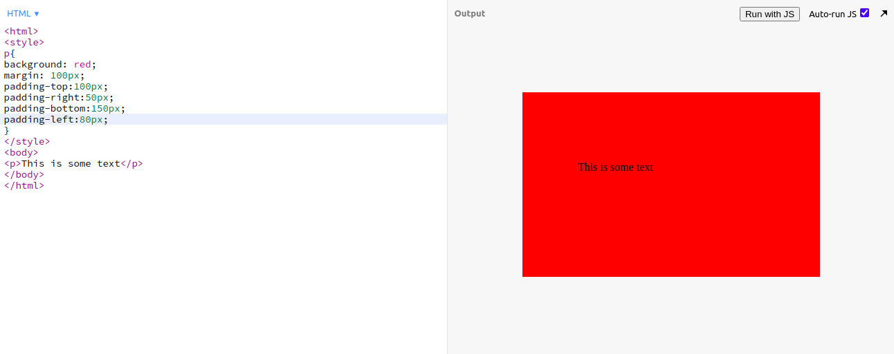

<h2>Well hello there my Gorgeous friends on the internet.</h2>

<h2>let me introduce my self first! My name is pawan and  <iframe src="https://giphy.com/embed/LJnA13jCK3K8g" frameBorder="0" ></iframe> Just kidding. You can Find me Here -> <a href="https://pavandeore.github.io">Portfolio</a>
 
Okay. So what are we looking at 
</h2>
<h2>⚙ Topic : Introduction to CSS Properties ⚙</h2>

<h2>Today we will explore two properties in CSS</h2>
<h4>
<ul>
<li>Margin</li>
<li>Padding</li>
</ul>
</h4>

<h3>1] Margin</h3>
<h4>
<ul>
<li>margin property is generally used to create space around the element. suppose I want 100px space around all 4 sides of the element I will use margin property.</li>
<li>
Example 
1] Visit <a href="https://jsbin.com/">jsBin</a> which will give basic coding environment. 
2] Then type 
  
<blockquote>
&lt;html&gt; 
&lt;style&gt; 
p{ 
    background: red; 
    margin: 100px; 
  }
 &lt;/style&gt; 
&lt;body&gt; 
&lt;p&gt;This is some text&lt;/p&gt; 
&lt;/body&gt; 
&lt;/html&gt;
</blockquote>
3] You will see this output 
 
As we can see here we got 100px margin to all sides of the element.
</li>
<li>let say we want to provide different values to margin then we have options.
<ul>
<li>margin-top</li>
<li>margin-right</li>
<li>margin-bottom</li>
<li>margin-left</li>
</ul>
</li>
<li>
Example  
<blockquote>
&lt;html&gt; 
&lt;style&gt; 
p{ 
background: red; 
margin-top: 100px; 
margin-right:500px; 
margin-bottom:300px; 
margin-left:50px; 
}
 &lt;/style&gt; 
&lt;body&gt; 
&lt;p&gt;This is some text&lt;/p&gt; 
&lt;/body&gt; 
&lt;/html&gt;
</blockquote>
Output: 
 
 
</li>
</ul>
<h4>

<h3>2] Padding</h3>
<h4>
<ul>
<li>Padding property is generally used to generate space inside the content box below the border and margin level. You will know better have a look at example.</li>
<li>
Example  
<blockquote>
&lt;html&gt; 
&lt;style&gt; 
p{ 
    background: red; 
    margin: 100px; 
    padding: 100px; 
  }
 &lt;/style&gt; 
&lt;body&gt; 
&lt;p&gt;This is some text&lt;/p&gt; 
&lt;/body&gt; 
&lt;/html&gt;
</blockquote>
You will see this output 
 
As we can see here we got 100px padding to all sides of the element.
</li>
<li>let say we want to provide different values to padding then we have options same as margin.
<ul>
<li>padding-top</li>
<li>padding-right</li>
<li>padding-bottom</li>
<li>padding-left</li>
</ul>
</li>
<li>
Example  
<blockquote>
&lt;html&gt; 
&lt;style&gt; 
p{ 
background: red; 
margin: 100px; 
padding-top:100px; 
padding-right:50px; 
padding-bottom:150px; 
padding-left:80px; 
}
 &lt;/style&gt; 
&lt;body&gt; 
&lt;p&gt;This is some text&lt;/p&gt; 
&lt;/body&gt; 
&lt;/html&gt;
</blockquote>
Output: 
 
 
</li>
</ul>
<h4>

Thanks 😊
