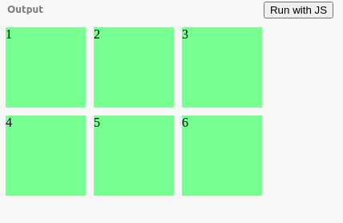
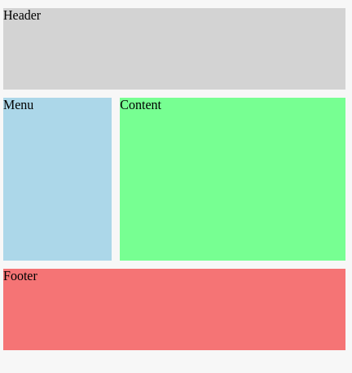

<h2>Well hello there my Gorgeous friends on the internet 🌏.</h2>

<h2>let me introduce my self first! My name is pawan and  Thats it!  Just kidding. You can Find me Here -> <a href="https://pavandeore.github.io">Portfolio</a>
 
Okay. So what are we looking at 
</h2>
<h2>⚙ Topic : GRID - All Properties ⚙</h2>

<h3>What is GRID </h3>
<h4>
CSS grid is a layout method that supports 2D system. Basically it can handle both columns and rows, if we consider our webpage layout in terms of columns and rows. CSS grid gives you more control on your layout, you can assign rules to the parent.
</h4>
<h4>
In this article you will get to know all the possible ways to use CSS grid in your website and we will acheive same output but with different approaches.
</h4>

<h4>We will be creating this layout.</h4>
 

 
<h4>
Steps will be  
<ul>
<li>So visit <a href="https://www.jsbin.com">JSBin</a> or Create your Developement environment on the local computer. </li> 
<li>
Code: 
<blockquote>
&lt;html&gt; 
&lt;head&gt; 
  &lt;meta charset="utf-8"&gt; 
  &lt;meta name="viewport" content="width=device-width"&gt; 
  &lt;title&gt;Grid Properties&lt;/title&gt; 
  &lt;style&gt; 
  .container &gt; div{ 
  background: lightgreen; 
 } 
.container{ 
  display: grid; 
  grid-gap:10px; 
  grid-template-columns: 100px 100px 100px; 
  grid-template-rows: 100px 100px; 
 } 
 &lt;/style&gt; 
&lt;/head&gt; 
&lt;body&gt; 

  &lt;div class="container"&gt; 
    &lt;div class="a"&gt;1&lt;/div&gt;
    &lt;div class="b"&gt;2&lt;/div&gt;
    &lt;div class="c"&gt;3&lt;/div&gt;
    &lt;div class="d"&gt;4&lt;/div&gt;
    &lt;div class="e"&gt;5&lt;/div&gt;
    &lt;div class="f"&gt;6&lt;/div&gt; 
  &lt;/div&gt;
&lt;/body&gt;
&lt;/html&gt;
</blockquote>
</li> 
<li> We have root element Container which we set display property to Grid now grid in enabled on the element.
</li> 
<li>
We have six elment on the page and want to display like in output image.
</li> 
<li>Code Part
<blockquote>
.container{ 
  display: grid; 
  grid-gap:10px; 
  grid-template-columns: 100px 100px 100px; 
  grid-template-rows: 100px 100px; 
 } 
</blockquote>
This will enable grid behaviour in container element. <kbd>grid-template-columns : 100px 100px 100px;</kbd> will create 3 columns of 100px in size. <kbd>grid-template-rows : 100px 100px;</kbd> will arrange those columns in 2 rows of 100px height;. <kbd>grid-gap</kbd> will provide gap in between elements.
</li> 
<li>
Instead of using it like this you can use this also,
<blockquote>
.container{ 
  display: grid; 
  grid-gap:10px; 
  grid-template: repeat(2,100px) / repeat(3, 100px); 
 } 
</blockquote>
well, I know that I want 2 rows and 3 columns of same size so I used <kbd>grid-template: row / column</kbd> Property here. Now consider repeat functions working like <kbd>repeat(how many times, how much size)</kbd>.
</li> 
</ul>
</h4>

<h4>Another example.   
</h4> 

 

<h4>We will create Same layout with different styles.</h4>
<h4>
1]
<ul>
<li>
Code: 
<blockquote>
&lt;html&gt; 
&lt;head&gt; 
  &lt;meta charset="utf-8"&gt; 
  &lt;meta name="viewport" content="width=device-width"&gt; 
  &lt;title&gt;Grid Properties&lt;/title&gt; 
  &lt;style&gt; 
  .container{ 
    display: grid; 
    grid-gap:10px; 
    grid-template-columns : repeat(3,1fr); 
    grid-template-rows: 100px 200px 100px; 
  } 
  .header{ 
    background: lightgray; 
    grid-column-start:1; 
    grid-column-end:-1; 
  } 
  .menu{ 
    background: lightblue; 
    grid-column:1 / 2; 
  } 
  .content{ 
    background: lightgreen; 
    grid-column:2 / -1; 
  } 
  .footer{ 
    background: lightcoral; 
    grid-column:1 / -1; 
  } 
 &lt;/style&gt; 
&lt;/head&gt; 
&lt;body&gt; 
  &lt;div class="container"&gt; 
    &lt;div class="header"&gt;Header&lt;/div&gt; 
    &lt;div class="menu"&gt;Menu&lt;/div&gt; 
    &lt;div class="content"&gt;Content&lt;/div&gt; 
    &lt;div class="footer"&gt;Footer&lt;/div&gt; 
  &lt;/div&gt; 
&lt;/body&gt; 
&lt;/html&gt; 
</blockquote>
</li> 
<li>
For the Container styles you know very well what does repeat function means, template columns and rows as well. i.e. It will divide column into 3 parts with <kbd>1 fr</kbd> that is fraction of the available space in the grid container.
</li> 
<li>
Now we want <kbd>header</kbd> to flow full width so, used <kbd>grid-column-start:1</kbd> & <kbd>grid-column-end:-1</kbd>. remember -1 is for until the end. Same rules will be applicable for <kbd>footer</kbd> as well.
</li> 
<li>
For the <kbd>menu</kbd> we want this division only 1 column wide so we used <kbd>grid-column-start:1</kbd> & <kbd>grid-column-end:2</kbd>.
</li> 
<li>
For the <kbd>content</kbd> we want this division to continue from last used column side i.e. 2 so we used <kbd>grid-column-start:2</kbd> & <kbd>grid-column-end:-1</kbd>.
</li> 
<li>This is how we can implement design layout in structured format.</li> 
</ul>
</h4>

<h4>
2]
<ul>
<li>Code 
<blockquote>
&lt;html&gt; 
&lt;head&gt; 
  &lt;meta charset="utf-8"&gt; 
  &lt;meta name="viewport" content="width=device-width"&gt; 
  &lt;title&gt;Grid Properties&lt;/title&gt; 
  &lt;style&gt; 
  .container{ 
    display: grid; 
    grid-gap:10px; 
    grid-template-columns : repeat(3,1fr); 
    grid-template-rows: 100px 200px 100px; 
    grid-template-areas :  
      "h h h" 
      "m c c" 
      "f f f"; 
  } 
  .header{ 
    background: lightgray; 
    grid-area: h; 
  } 
  .menu{ 
    background: lightblue; 
    grid-area: m; 
  } 
  .content{ 
    background: lightgreen; 
    grid-area: c; 
  } 
  .footer{ 
    background: lightcoral; 
    grid-area: f; 
  } 
 &lt;/style&gt; 
&lt;/head&gt; 
&lt;body&gt; 
  &lt;div class="container"&gt; 
    &lt;div class="header"&gt;Header&lt;/div&gt; 
    &lt;div class="menu"&gt;Menu&lt;/div&gt; 
    &lt;div class="content"&gt;Content&lt;/div&gt; 
    &lt;div class="footer"&gt;Footer&lt;/div&gt; 
  &lt;/div&gt; 
&lt;/body&gt; 
&lt;/html&gt; 
</blockquote>
</li> 
<li>
Look into the styles of container 
<blockquote>
  .container{ 
    display: grid; 
    grid-gap:10px; 
    grid-template-columns : repeat(3,1fr); 
    grid-template-rows: 100px 200px 100px; 
    grid-template-areas :  
      "h h h" 
      "m c c" 
      "f f f"; 
  } 
</blockquote> 
Here we can see we used new property <kbd>grid-template-areas</kbd> what this does actually it will let you create the visual representation structure of the template.  
So we divided our container into 3 parts with 1 fr width.   Now
First value  <kbd>h h h</kbd> means that for the 3 parts in 1st row <kbd>h</kbd> component will be present.  
On the 2nd row value <kbd>m c c</kbd> means 1 part of  <kbd>m</kbd> component and remaning 2 parts for the <kbd>c</kbd> component in the row.  

On the 3rd row value <kbd>f f f</kbd> means <kbd>f</kbd> component will display in 3 parts.
</li> 
<li>
We are supposed to assign component value to our required divisions using <kbd>grid-area</kbd> property. that we did in this part. 
<blockquote>
.header{ 
    background: lightgray; 
    grid-area: h; 
  } 
</blockquote> 
<blockquote>
  .menu{ 
    background: lightblue; 
    grid-area: m; 
  } 
</blockquote> 
<blockquote>
  .content{ 
    background: lightgreen; 
    grid-area: c; 
  } 
</blockquote> 
<blockquote>
  .footer{ 
    background: lightcoral; 
    grid-area: f; 
  } 
</blockquote> 
</li>
</ul>

</h4>

<h5>If you prefer to learn grid by playing you can visit <a href="https://cssgridgarden.com/">CSS Grid Garden 🔗</a></h5>

Always change the values and play around with code, this will give you better understanding. 

Thanks. 😄
