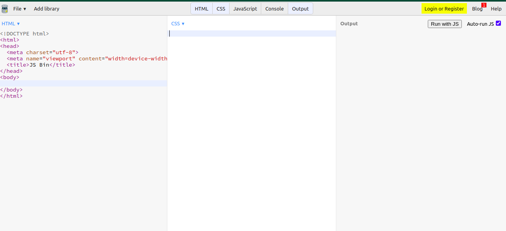
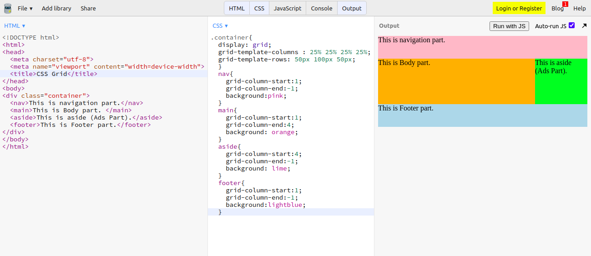

<h2>Well hello there my Gorgeous friends on the internet 🌏.</h2>

<h2>let me introduce my self first! My name is pawan and  Thats it!  Just kidding. You can Find me Here -> <a href="https://pavandeore.github.io">Portfolio</a>
 
Okay. So what are we looking at 
</h2>
<h2>⚙ Topic : Introduction to CSS GRID ⚙</h2>

<h3>What is CSS grid?</h3>
<h4>CSS grid is a layout method that supports 2D system. Basically it can handle both columns and rows, if we consider our webpage layout in terms of columns and rows. CSS grid gives you more control on your layout, you can assign rules to the parent.
</h4>
<h4>
So basically what we do in CSS Grid is actually divide our design components into rows and columns. with the help of GRID we can design complex structures in simple manner.
</h4>
<h4>
Okay so.
Take a look at this layout. We will try to understand GRID working by building this layout. 
 
 We are going to build this layout.
</h4>
<h4>
Steps will be  
<ul>
<li>So visit <a href="https://www.jsbin.com">JSBin</a> or Create your Developement environment on the local computer. </li> 
<li>Initially there will be 2 tabs open i.e. <kbd>html</kbd> and <kbd>output</kbd> Part. click on the <kbd>css</kbd>. Your screen should look like this. 

  
</li> 
<li>
Okay. copy this code first, I will expalin in upcoming points.
<blockquote>
&lt;html&gt; 
&lt;head&gt; 
  &lt;meta charset="utf-8"&gt; 
  &lt;meta name="viewport" content="width=device-width"&gt; 
  &lt;title&gt;CSS Grid&lt;/title&gt; 
  &lt;style&gt; 
  .container{ 
  display: grid; 
  grid-template-columns : 25% 25% 25% 25%; 
  grid-template-rows: 50px 100px 50px; 
  } 
  nav{ 
    grid-column-start:1; 
    grid-column-end:-1; 
    background:pink; 
  } 
  main{ 
    grid-column-start:1; 
    grid-column-end:4; 
    background: orange; 
  } 
  aside{ 
    grid-column-start:4; 
    grid-column-end:-1; 
    background: lime; 
  } 
  footer{ 
    grid-column-start:1; 
    grid-column-end:-1; 
    background:lightblue; 
  } 
  &lt;/style&gt; 
&lt;/head&gt; 
&lt;body&gt; 
&lt;div class="container"&gt; 
  &lt;nav&gt;This is navigation part.&lt;/nav&gt; 
  &lt;main&gt;This is Body part. &lt;/main&gt; 
  &lt;aside&gt;This is aside (Ads Part).&lt;/aside&gt; 
  &lt;footer&gt;This is Footer part.&lt;/footer&gt; 
&lt;/div&gt;   
&lt;/body&gt; 
&lt;/html&gt; 
</blockquote>
</li> 
<li>
As you can see First at the ROOT level Only one element is there i.e. <kbd>Container</kbd> in the stylings I made its display property to Grid. Which enables Grid behaviour on this element.
<blockquote>
.container{ 
  display: grid; 
  grid-template-columns : 25% 25% 25% 25%; 
  grid-template-rows: 50px 100px 50px; 
  } 
</blockquote>
Four times I used 25% it means create 4 column structure with equal width, and in the rows i have used 50px 100px 50px it means give height to the 3 respective rows.
</li> 
<li>
Now I will explain the <kbd>nav</kbd> the same rule follows for remaining sections.
<blockquote>
nav{ 
    grid-column-start:1; 
    grid-column-end:-1; 
    background:pink; 
  } 
</blockquote>
So as per our layout I want navigation to cover whole width i.e. we have divided our <kbd>continer</kbd> into 4 columns right?. Now I will tell my <kbd>nav</kbd> to cover from <kbd>grid-column-start:1</kbd> to <kbd>grid-column-end:-1;</kbd>. -1 nothing but go until the END.
</li> 
<li>Same concept will be applicable for remaining elements. 
Example 
I want my Body part extend till 4th side and Ads part from the 4th to end. I will write.
<blockquote>
  main{ 
    grid-column-start:1; 
    grid-column-end:4; 
    background: orange; 
  } 
  aside{ 
    grid-column-start:4; 
    grid-column-end:-1; 
    background: lime; 
  } 
</blockquote>
</li> 
<li>
Overall your final code should look like this.
 

 
</li> 
</ul>
</h4>

Always change the values and play around with code, this will give you better understanding. 

<a href="../Pawan_WD_GRID_PROPERTIES/Pawan_WD_GRID_PROPERTIES.md">Click here to get more Information about Grid Properties 🔗</a>

Thanks. 😄
