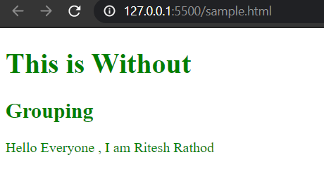
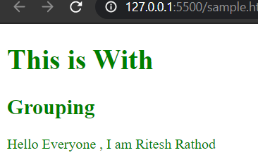
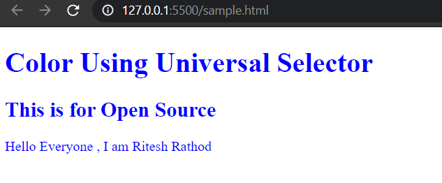
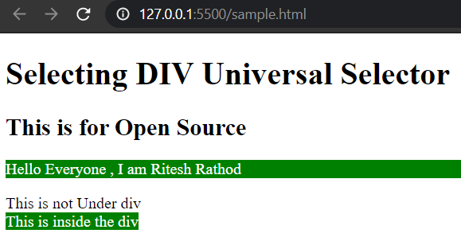

# :computer:***Grouping Code***:computer:

## Case 1  Without Grouping :heavy_check_mark:

```html
<!DOCTYPE html>
<html lang="en">

<head>
    <meta charset="UTF-8">
    <meta name="viewport" content="width=device-width, initial-scale=1.0">
    <title>Grouping</title>
    <style>

        h1{
            color:green;
        }

        h2{
            color:green;
        }

        .text{
            color:green;
        }
        
    </style>
</head>

<body>

    <h1>This is Without </h1>
    <h2>Grouping</h2>
    <div>
        <p class="text"> Hello Everyone , I am Ritesh Rathod </p>
    </div>

</body>

</html>
```

## OUTPUT:open_mouth:

<br>



<br>

**Click me to visit Theory File [Ritesh_WD_Grouping](../Ritesh_WD_Grouping.md)**

<br>


## Case 2 With Grouping :cyclone:

```html
<!DOCTYPE html>
<html lang="en">

<head>
    <meta charset="UTF-8">
    <meta name="viewport" content="width=device-width, initial-scale=1.0">
    <title>Grouping</title>
    <style>
        h1,
        h2,
        .text {
            color: green;
        }
    </style>
</head>

<body>

    <h1>This is With</h1>
    <h2>Grouping</h2>
    <div>
        <p class="text"> Hello Everyone , I am Ritesh Rathod </p>
    </div>

</body>

</html>
```

## OUTPUT :walking:

<br>



<br>

**Click me to visit Theory File [Ritesh_WD_Grouping](../Ritesh_WD_Grouping.md)**

<br>


# :pager:***Universal Selector Code***:pager:

<br>

## Case 1  Selecting All Elements :turtle:

```html
<!DOCTYPE html>
<html lang="en">

<head>
    <meta charset="UTF-8">
    <meta name="viewport" content="width=device-width, initial-scale=1.0">
    <title>Grouping</title>
    <style>
        * {
            color: blue;
        }
    </style>
</head>

<body>

    <h1>Color Using Universal Selector</h1>
    <h2>This is for Open Source</h2>
    <div>
        <p> Hello Everyone , I am Ritesh Rathod </p>
    </div>

</body>

</html>
```
<br>

## OUTPUT :open_mouth:


<br>



<br>

**Click me to visit Theory File [Ritesh_WD_Grouping](../Ritesh_WD_Grouping.md)**

<br>

## Case 2  Selecting All DIV Elements :lock:

```html
<!DOCTYPE html>
<html lang="en">

<head>
    <meta charset="UTF-8">
    <meta name="viewport" content="width=device-width, initial-scale=1.0">
    <title>Grouping</title>
    <style>
        div * {
            color: white;
            background-color: green;
        }
    </style>
</head>

<body>

    <h1>Selecting DIV Universal Selector</h1>
    <h2>This is for Open Source</h2>
    <div>
        <p class="red"> Hello Everyone , I am Ritesh Rathod </p>
    </div>

    <span class="red">This is not Under div</span>

    <div>
        <span>This is inside the div</span>
    </div>
</body>

</html>
```
<br>

## OUTPUT :hushed:

<br>



<br>

**Click me to visit Theory File [Ritesh_WD_Grouping](../Ritesh_WD_Grouping.md)**

<br>
<br>

## ***Thank You For Reading*** :innocent:
## ***Hope You Enjoyed it !!!***
