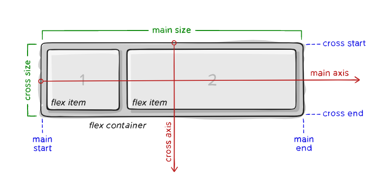

# ***Hello Everyone , Welcome*** :heart_eyes:

<br>

# **I am ***Ritesh Rathod***** :wink:
### My Social Handel <a href="https://www.linkedin.com/in/ritesh-rathod-26054a183/" target="_blank"></a>

### You Can Contact me at <a href="mailto:rnrathod16@gmail.com" target="_blank"></a>

<br>

## Topic :- :pencil2: Introduction to ***FLEXBOX***  :pencil2:

<br>

<br>

# :wrench: ***FLEXBOX*** :wrench:

- It was designed as a one dimensional layout model :boat:

```
The meaning of flex box as one dimensional 
it means it deals with layout in one direction
at a time -either as a row or coloumn.
```

- It provides an more efficient way to align and distribute space among items in the container :pen:

``` 
This can be done even when the sizes of 
the items are unknown or Dynamic ( thus the word FLEX )
```

- The idea was to give the container the ability to alter the item's **Width/Height** to best fill the available space :frog:

```
A flex Container expands items to fill available 
free space or shrinks them to prevent overflow
```
<br>

<br>

# ***BASICS*** :hammer:

Since Flexbox is a whole bunch of module and not an single property . It includes lot of properties , Some of them maybe for Container or the children items:pencil2:

<br>

*Items will be laid as follows either the **main axis** ( from main-start to main-end ) or the **cross axis** ( from cross-start to cross-end )* :star:

<br>



<br>

<br>

### **main axis :-**  :star:
```
The main axis of flex container is the 
primary  axis along which the flex items
are laid out.
```
<br>

### **main-start | main-end :-** :star:
```
The items are placed within the container 
starting from main-start and going towards
main-end
```
<br>

### **main size :-**:star:
```
The item's Width or Height whichever 
is in the main dimension is item's main size
```
<br>

### **cross axis :-**:star:
```
The axis which is perpendicular to main axis is 
called the cross axis . Its's direction depends
on the main axis direction.
```
<br>

### **cross-start | cross-end :-**:star:
```
The items are placed into the container starting
on the cross-start side of the container and going
toward the cross-end side
```
<br>

### **cross size :-** :star:
```
The dimension width and height of the item is the cross size
```


<br>

<br>


**[Reference](https://developer.mozilla.org/en-US/docs/Web/CSS/CSS_Flexible_Box_Layout/Basic_Concepts_of_Flexbox) Checkout this link for more Information** :link:

<br>

<br>

<br>


<a href="https://www.linkedin.com/in/ritesh-rathod-26054a183/" target="_blank"></a>
<a href="mailto:rnrathod16@gmail.com" target="_blank"></a>
<a href="https://github.com/rnrathod16"></a>

## ***Thank You For Reading***:innocent:
## ***Hope You Enjoyed it*** :bangbang:


