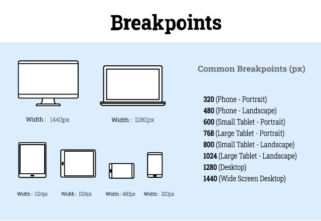

  <h1 align="center"><b>Hi there, I'm <a href="https://www.github.com/imrushikesh">Rushikesh!</a></b>
  
   
    

  </h1>

  

  <h2 align="center"><b>📜 Introduction to Responsive Design 📜 </b></h2>
 

Responsive Design adapt itself to any  user device.Responsive design ensures that Web Design displays on desktops,Laptops and mobile-tablet devices is Standard,Flexible and User Friendly.

*** 

  
 Responsive Design Topics 📁  

1. Introduction to Responsive Design.<a href="Rushikesh_CSS_Resp.md">👉</a>
2. Responsive Design Breakpoints.<a href="#Break">👇</a>
3. Media Queries.<a href="Rushikesh_CSS_MediaQ.md">👉</a>

***

Breakpoints are points to determine when to change the Content, Layout of the Web and adapt the new rules Defined in the media queries.
    

***

<b><i>Topic : CSS Breakpoints. </i><b>

  
***

✔️ Introduction  - 

- In responsive design, a breakpoint is a point at which the content of the Website and design will change/adapt in a certain way.
- Which provides the best user experience. 
- Breakpoints are pixel values, those are defined in CSS by Designer/Developer.
- A transformation occurs,  When a responsive website reaches those pixel values.
- Media Queries are used for applying Breakpoints.<i> More about Media Query.</i> <a href="Rushikesh_CSS_MediaQ.md">👉</a>

***

✔️ Adding Breakpoints  - 
1. Always design and Develop for Mobile-First.
2. Prioritize very important menu options.
3. Remove anything unnecessary and visually distracting.
4. Use of  Media Queries -
   - Research on most commonly used devices and screen size of those devices.
   - Hide and Display Certain elements at certain Breakpoints.
   - <i> More about Media Query.</i> <a href="Rushikesh_CSS_MediaQ.md">👉</a>

***

<b><i>Most Common Breakpoints -</i><b>

***

  
- Additional Information -
  - 🔗  CSS Official [Website.](https://www.w3.org/Style/CSS/)
  - 🔗 [ CSS Box-Model.](https://www.w3.org/TR/CSS22/box.html)
  - 🔗 [CSS Media Queries.](https://www.w3.org/TR/css3-mediaqueries/)
   - 🔗 MDN Web Docs- [Media queries.](https://developer.mozilla.org/en-US/docs/Web/CSS/Media_Queries/Using_media_queries)

***

  <h2 align="center"><i>😍 Thank You 🙏 Contact -</i></h2> 
  
 
 

    

 

 ***
 
 
