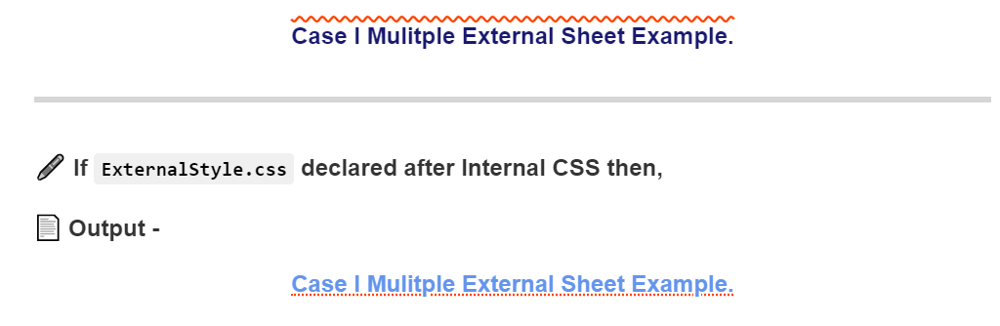
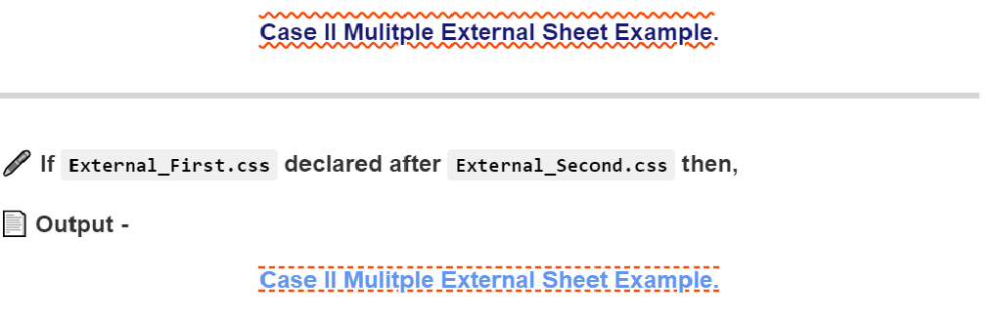

<p align="center">
  <h1 align="center"><b>Hi there, I'm <a href="https://www.github.com/imrushikesh">Rushikesh!</a></b>
  
   <a  href="https://www.linkedin.com/in/rushikesh-patil-1a3937189"></a>
    <a href="mailto:rushipatil241297@gmail.com"></a>
    <!--     <a href="mailto:rushipatil241297@gmail.com"></a> -->
  </h1>
</p>


  <p align="center">
  <h2 align="center"><b>📜 Introduction to CSS 📜 </b></h2>
 <p align="center">
Cascading Style Sheet Control look and feel of Web Pages. We use it to style  HTML documents and to display its element more creatively. Basically, it gives life to HTML Structure. 
</p>
</p>


***

<P align="center" id="multiple"><b><i>Topic 2 <u>Examples</u>: External Style Sheet using Multiple Style Sheets.</i><b></p>
  
***


✔️ External Style Sheet using Multiple Style Sheets - 

- External CSS is linked to HTML document using `<link>`.
- Used to style Complete HTML Document.
- Multiple External Files contains all style of HTMl document. 
- `.css` Extension is used for External CSS file. Any Text/Code editor can be used for write External CSS (ex. VS code, Brackets, Atom)
- Used to Oraganize and style Large HTML document.(ex.Separate Style for Desktop and Mobile View of same Website)
- Priority Depends on Last Declared Style Sheet.


📝 Multiple External CSS Files Example -

🖊️ Link External CSS inside head -

```html
<head>

<!--External CSS 1 -->
<link rel="stylesheet" href="styleFirst.css">

<!--External CSS 1 -->
<link rel="stylesheet" href="styleSecond.css">

</head>

```
🖊️ Inside `styleFirst.css` External CSS File -

```css

h5 {
 color: MidnightBlue;
 text-align:center;
 text-decoration: overline wavy OrangeRed;
}

```
🖊️ Inside `styleSecond.css` External CSS File -

```css

h6 {
 color: MidnightBlue;
 text-align:center;
 text-decoration: underline wavy OrangeRed;
}

```
🖊️ Inside HTML Body

```html
<h5>This is example of Multiple External CSS. (styleFirst.css)</h5>
<h6>This is example of Multiple External CSS. (styleSecond.css)</h6>
```


📄 Output -

<!-- <h5 style="color:MidnightBlue;text-align:center;text-decoration: overline wavy OrangeRed;">This is example of Multiple External CSS. (styleFirst.css)</h5>
<h6 style="color:MidnightBlue;text-align:center;text-decoration: underline wavy OrangeRed;">This is example of Multiple External CSS. (styleSecond.css)</h6> -->

<p align=" center"></p>
***


✔️ ***External Style sheet can be used in two ways:***

1. Case I - Placing Internal and External Style Sheet in Same document. 
2. Case II - Linking 2 Separate Style Sheet in Same Document. 

>In both Cases If Same element, class or id is declared then priority depends on last declared style sheet. Example code. 


📝 ***Case I - Placing Internal and External Style Sheet in Same document.***

🖊️ Link External CSS inside head before Internal CSS -

```html
<head>
<!--External CSS -->
<link rel="stylesheet" href="ExternalStyle.css">

<!--Internal CSS -->
<style>
h5 {
 color: MidnightBlue;
 text-align:center;
 text-decoration: overline wavy OrangeRed;
}
</style>
</head>

```
🖊️ Inside `ExternalStyle.css` External CSS File -

```css

h5 {
 color: CornflowerBlue;
 text-align:center;
 text-decoration: underline dotted OrangeRed;
}

```

🖊️ Inside HTML Body

```html
<h5>Case I Mulitple External Sheet Example.</h5>
```


📄 Output -

<!-- <h5 style="color:MidnightBlue;text-align:center;text-decoration: overline wavy OrangeRed;">Case I Mulitple External Sheet Example.</h5>

***
🖊️ If `ExternalStyle.css` declared after Internal CSS then,

📄 Output - 

<h5 style="color:CornflowerBlue;text-align:center;text-decoration: underline dotted OrangeRed;">Case I Mulitple External Sheet Example.</h5> -->

<p align=" center"></p>


***

📝 Case II - Linking 2 Separate Style Sheet in Same Document. 


🖊️ Link Multiple External CSS inside head  -

```html
<head>
<!--External CSS 1 -->
<link rel="stylesheet" href="External_First.css">

<!--External CSS 2 -->
<link rel="stylesheet" href="External_Second.css">
</head>

```
🖊️ Inside `External_First.css` External CSS File -

```css

h5 {
 color: DarkMagenta;
 text-align:center;
 text-decoration: overline underline dashed OrangeRed;
}

```

🖊️ Inside `External_Second.css` External CSS File -

```css

h5 {
 color: CornflowerBlue;
 text-align:center;
 text-decoration: overline underline wavy OrangeRed;
}

```

🖊️ Inside HTML Body

```html
<h5>Case II Mulitple External Sheet Example.</h5>
```


📄 Output -

<!-- <h5 style="color:MidnightBlue;text-align:center;text-decoration: overline underline wavy OrangeRed;">Case II Mulitple External Sheet Example.</h5>

***
🖊️ If `External_First.css` declared after `External_Second.css` then,

📄 Output - 

<h5 style="color:CornflowerBlue;text-align:center;text-decoration: overline underline dashed OrangeRed;">Case II Mulitple External Sheet Example.</h5> -->

<p align=" center"></p>

***
<p align="center">Multiple Style Sheet <br><a href="Rushikesh_CSS_MultipleStyleSheet.md"></a></p>


***


<p align="left">
  
- Additional Information -
  - 🔗 The World Wide Web Consortium (W3C) [Official Website.](https://www.w3.org)
   - 🔗  CSS Official [Website.](https://www.w3.org/Style/CSS/)
   - 🔗 CSS Current [Work Page.](https://www.w3.org/Style/CSS/current-work)
   - 🔗 CSS Official [Working Group.](https://www.w3.org/Style/CSS/members)
   
   
   

<p align="center">
  <h2 align="center"><i>😍 Thank You 🙏 Contact -</i></h2> 
  
 <p align="center"> <a  href="https://www.github.com/imrushikesh"></a>
<a  href="https://www.linkedin.com/in/rushikesh-patil-1a3937189"></a>
<a href="mailto:rushipatil241297@gmail.com"> </a></p>
<!--    <a href="mailto:rushipatil241297@gmail.com"></a> -->
      
  
      
</p>
 
 ***